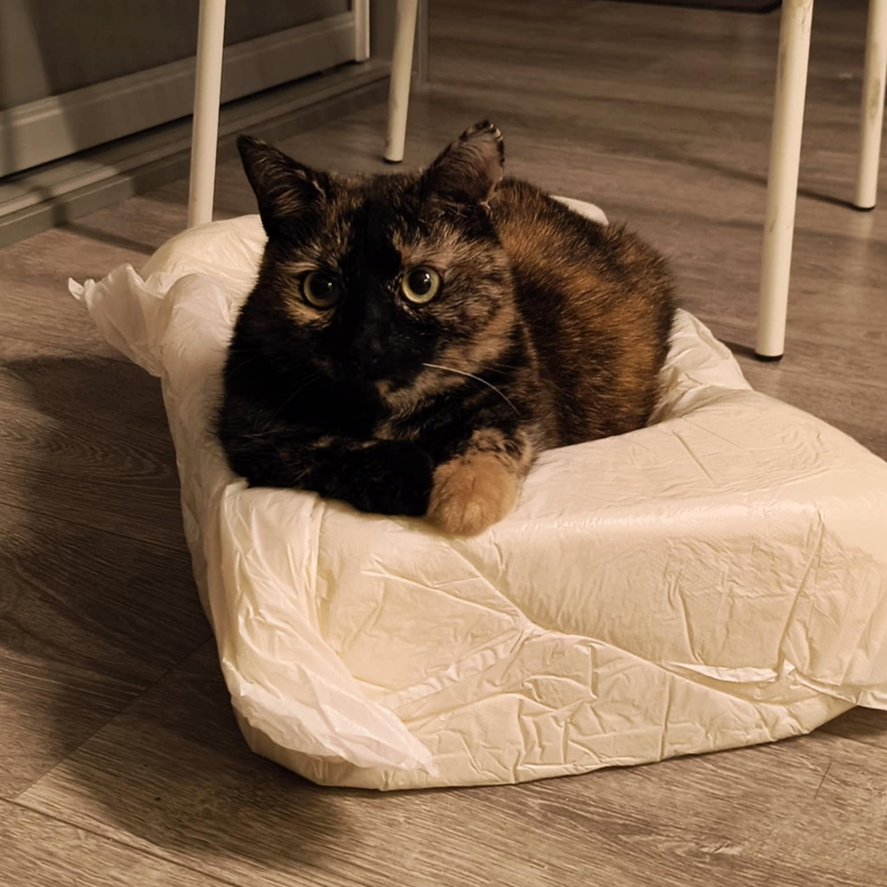

# 👋 Hello, I'm Kubabob!

Welcome to my GitHub profile! I'm a developer with expertise in full-stack web development, scientific computing, and data science. My work spans from modern web applications to computational physics simulations.

## 😺 Meet My Coding Assistants

  
  
  
<i>My feline coding partners who ensure I never miss a bug (or a nap)</i>

## 🚀 Projects

### Web Development
- [**Pokoje Gościnne Justyna**](https://github.com/Kubabob/pokoje-goscinne-justyna) - A modern hotel website built with Next.js 13 and Payload CMS as a headless content management system
- [**Next.js Dashboard**](https://github.com/Kubabob/nextJsDashboard) - A responsive dashboard application with data visualization, authentication, and real-time updates
- [**Hotel Website**](https://github.com/Kubabob/hotel-website) - Another hotel website project showcasing my web development skills

### Scientific Computing & Data Science
- [**Food Recognition System**](https://github.com/Kubabob/fridge_project) - Computer vision system using YOLO segmentation models for real-time food detection and identification
- [**Chemical Data Explorer**](https://github.com/Kubabob/chemical-data-explorer) - Advanced data exploration techniques applied to chemical compounds datasets
- [**Quantum Pulse Analysis**](https://github.com/Kubabob/quantum-pulse-analysis) - Computational physics simulations focusing on entropy in quantum systems and pulse effects on atomic excitation
- [**Stochastic Models in Science**](https://github.com/Kubabob/stochastic-models-in-science) - Implementations of various stochastic processes including percolation theory, random walks, and population genetics models
- [**Licencjat**](https://github.com/Kubabob/licencjat) - My bachelor's thesis project
- [**Cholerny Impedant**](https://github.com/Kubabob/cholerny-impedant) - Physics simulation project

## 💻 Technical Skills

## 🎓 Research Interests
- Computational Physics
- Stochastic Processes
- Computer Vision
- Quantum Computing
- Data Visualization

## 📫 Connect With Me
Feel free to reach out for collaborations, job offers or just a chat about technology and science!

---

⭐️ From [Kubabob](https://github.com/Kubabob)
